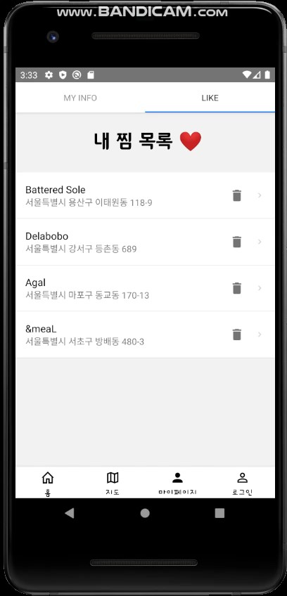

# :coffee: ​FOOWIPE :rice_ball:

## 빅데이터를 이용한 음식점 추천 모바일 어플리케이션


## :blue_book: 목차 

1. Technologies Used

2. Introduction

3. Expectation 

4. Roles 

5. Sequence Diagram 

6. Database ERD  & APIs

7. Features  :blue_heart:

8. Recommendation Algorithm 

9. Video Link

   

## :star: ​Technologies Used

Python Django, MySQL, Django rest framework, Beautiful Soup

React-native, Naver 지도 API


## :bulb: Introduction

카드사의 음식점 이용 내역 데이터를 이용해 무엇을 만들 수 있을 지 고민했다. 소개팅 어플인 스와이프처럼 옆으로 미는 방식을 통해 음식점을 간편하게 선택하면 좋을 것 같아 이 앱을 기획하게 되었다. 

또한 웹과 모바일 어플 중 어느 것으로 개발할 지 고민했는데 음식점을 찾는 것은 밖에 나간 상황에서 모바일 이용이 더 클 것이라 생각해 모바일 어플로 개발하였다.


## :cloud:  Expectation 

현재 상용중인 음식점 추천 어플(망고플레이트)는 위치기반 어플이다. 그러나 너무 많은 정보가 제공되어 사용자가 복잡하게 느낄 수 있다. 간편한 핵심 기능 두 가지와 직관적인 UX/UI를 제공해 앱을 편리하게 이용하도록 했다.

또한 swipe기능을 이용해 내 주변 음식점 중 20곳을 추천받고 이 중에 원하는 음식점을 선택해 그 위치를 안내받거나 지도에서 원하는 카테고리의 음식을 검색할 수 있도록(치킨) 설정했다. 


## :smile: Roles 

프로젝트 기간: 2020.3.30-2020.5.1   /   코로나19로 인해 원격으로 프로젝트 진행

| 이름   | 역할                                                         |
| ------ | ------------------------------------------------------------ |
| 백민주 | 프론트엔드 회원 관련 기능 구현, 마이페이지 찜 리스트 및 찜 삭제 기능 |
| 신채민 | 백엔트 추천 알고리즘 구현, 음식점 관련 API 개발              |
| 윤규희 | 프론트엔드 스와이프(음식점 여러 개 보여주기) 기능 구현, apk배포 |
| 이수민 | 백엔드 회원 관련 기능, token 구현, 찜 목록 관련 API 개발     |
| 정택진 | 프론트엔드 네이버 지도 API 이용한 현위치 & 음식점 위치 detail 페이지 apk배포 |


## :building_construction: Sequence Diagram 

```sequence
사용자 -> 어플리케이션 : 1. 카테고리 선택
어플리케이션 -> 서버 : 2. 사용자 위치 및 카테고리 전송
서버 -> 데이터베이스 : 3. 데이터 요청
데이터베이스 --> 서버 : 4. 데이터 전송
서버 --> 어플리케이션 : 5. 카테고리 이미지 전송(알고리즘 적용)
사용자 -> 어플리케이션 : 6. 컨텐츠 선택
어플리케이션 -> 서버 : 7. 컨텐츠 위치 정보 요청
서버 --> 어플리케이션 : 8. 위치 정보 전송
어플리케이션 -> 지도 API : 9. 위치 정보 입력
지도 API --> 어플리케이션 : 10. 지도 출력
```


## :computer: Database ERD  & APIs


API

https://docs.google.com/spreadsheets/d/1w8zaqwz2J5CQB5-NOSeB6Y0Er5cYQFXBVczPKCFi9oo/edit?ts=5ea62587#gid=0


##  :tumbler_glass: Features  

1. 현재 위치기반 음식점 추천 기능

첫 접속   화면


한 카테고리 선택 시 반경 1km내에 있는  20개의 카테고리 가게를 스와이프 방식으로 제시함. 오른쪽 혹은 왼쪽으로 넘기면 다음 혹은 이전 가게를 볼 수 있고 클릭 시 그 가게의 detail페이지를 볼 수 있음.

2. 찜하기 기능

   

디테일 페이지에서 하트를 누르면 찜하기 기능, 찜 한 제품은 향후 알고리즘에 반영되어 각 카테고리를 추천할 가능성이 높아짐

디테일 페이지에서 매장 정보, 메뉴, 이미지, 네이버 블로그 검색 결과를 확인 가능


지도 페이지에서 나의 현 위치(파란 점)과 주변 가게들 확인 가능, 카테고리 검색을 통해 특정 음식점 검색 가능(예: 치킨)



마이페이지 탭에서 내 정보(이메일, 아이디) 확인 가능, 내 찜 목록 확인 가능, 찜 목록 삭제 가능

+회원가입과 로그인, 로그아웃 기능도 구현

원래 내 주변 음식점 월드컵 기능도 존재했으나 시간상의 이유로 완성하지 못해 최종 결과에 넣지 않았다.


## :triangular_ruler: Recommendation Algorithm 

이클립스 ide에서 pydev를 사용해 개발

1. 랜덤 포레스트

앙상블 머신러닝 모델의 한 종류로 훈련을 통해 구성해 놓은 다수의 나무들로부터 결과 취합하는 알고리즘. 모든 의사결정 트리는 학습 데이터 세트에서 임의로 하위데이터 세트를 생성하는 배깅(bagging) 과정을 거침.

푸와이프는 모든 상점들을 음식점, 카페, 술집 세 가지로 분류할 때에 랜덤 포레스트 이용했음

2. 협업 필터링(Collaborative Filtering) 알고리즘

많은 사용자들로부터 얻은 기호 정보에 따라 관심사들을 자동적으로 예측하기 위해 고객들의 행동을 수치화하는 알고리즘. 

기존에 주어진 데이터 내 리뷰 수, 종합 별점, 평가자 수와 푸와이프 내 찜한 사람 수, 찜을 해제한 사람, 스와이프 기능으로 해당 상점을 선택한 사람 등을 수치화하여 추천. 


## :movie_camera: Video  Link

https://youtu.be/oi1ZnT_Q6yI